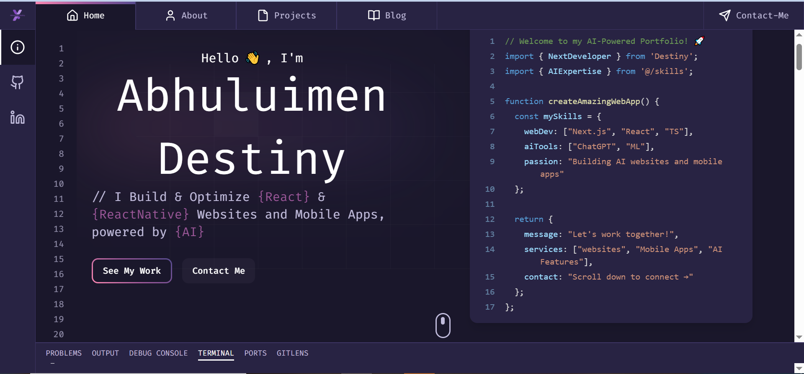

# Destiny Abhuluimen — Portfolio

This is my personal portfolio website — built with Next.js, React, and TypeScript, with an AI chat assistant (powered by Google Gemini) that visitors can use to ask about my work.



## About Me

I'm Destiny Abhuluimen, an independent full-stack developer and product builder based in Edo State, Nigeria. I take web apps and mobile apps from concept through deployment — specialising in **Next.js**, **React**, **FastAPI**, and **Supabase** — and have shipped trading platforms, real estate marketplaces, e-commerce apps, and browser automation tooling for clients in Nigeria and Europe.

I work across both engineering and product: schema design, API contracts, payment integrations (Paystack, Stripe), UI/UX, and deployment — including building [GitPulse](https://github.com/DDstar1), a self-hosted GitHub webhook deployment manager as a lightweight alternative to Coolify.

- 🌐 Website: [abhuluimendestiny.site](https://abhuluimendestiny.site)
- 💻 GitHub: [@DDstar1](https://github.com/DDstar1)
- 💼 LinkedIn: [Destiny Abhuluimen](https://www.linkedin.com/in/destiny-abhuluimen-20bb3726a)

## Featured Projects

- **Deriv Strategies** — Trading strategy marketplace for Nigerian Deriv traders, with bot-automated execution and public leaderboards (Next.js, FastAPI, Supabase, Deriv API).
- **Real Estate Platform** — Community-driven property platform with referral-agent commissions and interactive listing filters (Next.js, Supabase, Paystack).
- **InkCraft by David** — Custom clothing print-on-demand app with a Fabric.js canvas designer (Next.js 14, Fabric.js, Supabase, Stripe, Resend).

## Site Features

- 🤖 **AI Chat Assistant** - Ask the assistant questions about my background and projects, powered by Google Gemini
- 🚀 **Interactive Code Typing Animation** - Dynamic code display with syntax highlighting
- 💻 **Responsive Design** - Optimized for all devices from mobile to desktop
- 🎨 **Modern UI/UX** - Clean, professional interface with smooth animations
- 🌙 **Dark Mode** - Sleek dark theme for optimal viewing
- 📧 **Contact Form** - Integrated with Resend for reliable email delivery
- 🎯 **SEO Optimized** - Built-in metadata configuration

## Tech Stack

- **Framework**: Next.js
- **Language**: TypeScript
- **Styling**: Tailwind CSS with CSS Variables
- **Animations**: Framer Motion, Lottie
- **Form Handling**: React Hook Form with Zod validation
- **UI Components**: shadcn/ui, Lucide React Icons
- **Email Service**: Resend
- **AI Integration**: Google Gemini AI
- **Code Highlighting**: Prism React Renderer
- **Deployment**: Vercel

## Running Locally

1. **Clone the repository**

   ```bash
   git clone https://github.com/DDstar1/my-portfolio.git
   cd my-portfolio
   ```

2. **Install dependencies**

   ```bash
   npm install
   ```

3. **Set up environment variables**

   Create a `.env.local` file with:

   ```bash
   RESEND_API_KEY=your_resend_api_key
   GOOGLE_API_KEY=your_gemini_api_key
   ```

4. **Start the development server**

   ```bash
   npm run dev
   ```

5. **Build for production**

   ```bash
   npm run build
   ```

## Project Structure

- `app/` - Next.js app directory and API routes
  - `(main)/` - Main application routes
  - `api/` - API endpoints for email and chat
- `components/` - React components
  - `layout/` - Layout components (header, footer, etc.)
  - `sections/` - Page sections (home, about, projects, etc.)
  - `ui/` - Reusable UI components from shadcn/ui
- `data/index.ts` - All portfolio content (bio, projects, skills, contact)
- `hooks/` - Custom React hooks
- `lib/` - Utility functions and shared code
- `public/` - Static assets (`imgs/`, `skills/`, `projects-imgs/`, `lottie/`)

## Deployment

Deployed on Vercel. Required environment variables:

- `RESEND_API_KEY` - API key for the contact form's email service
- `GOOGLE_API_KEY` - API key for the Gemini-powered chat assistant

## Contact

Destiny Abhuluimen

- Website: [abhuluimendestiny.site](https://abhuluimendestiny.site)
- Email: abhuluimendestiny@gmail.com
- GitHub: [@DDstar1](https://github.com/DDstar1)

## License

This project is licensed under the MIT License - see the [LICENSE](LICENSE) file for details.

---

Made with ❤️ by Destiny Abhuluimen
